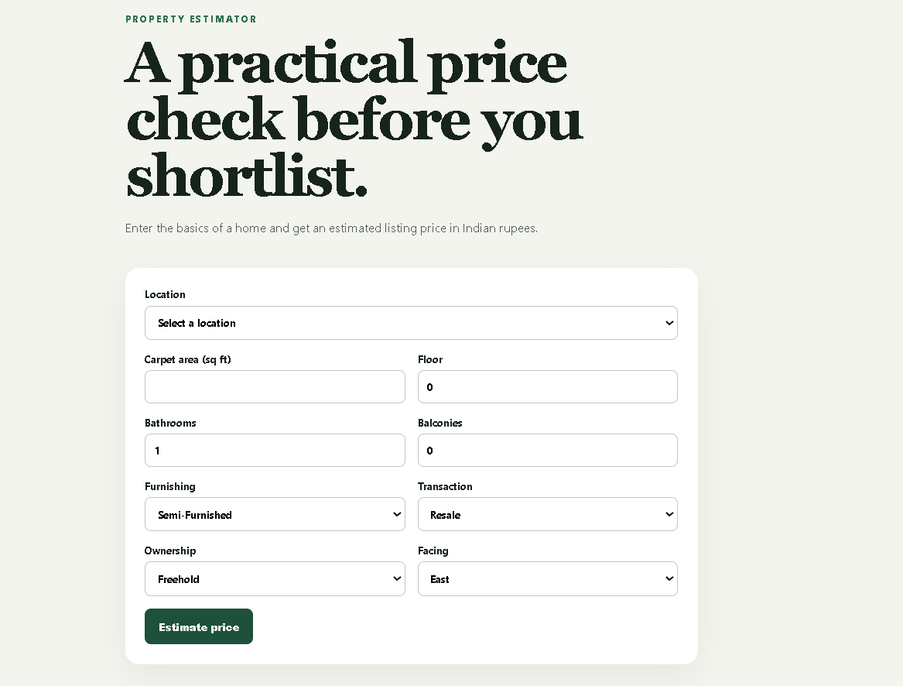
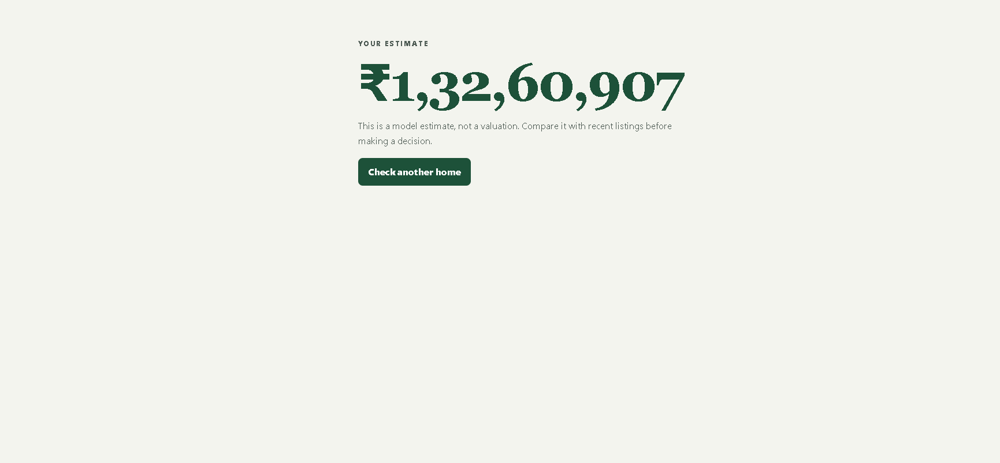

# House Price Predictor

A small end-to-end project for estimating Indian house listing prices. The training code does the messy work - parsing prices and areas, grouping rare locations, removing extreme price-per-sqft listings - and exports one scikit-learn pipeline. FastAPI serves that pipeline and a React form collects the property details.

The training process creates `backend/models/house_price.pkl` locally. It is intentionally excluded from Git because the trained file is too large for GitHub's standard file limit. The preprocessing and estimator are saved together in one scikit-learn pipeline, so the API can make predictions directly from the form inputs after training.

## What is in here

```text
React form (port 5173) -> FastAPI API (port 8000) -> saved sklearn Pipeline
                                             ^
                              notebook / training script creates it
```

| Part | Tools used |
| --- | --- |
| Analysis and model | pandas, matplotlib/seaborn, scikit-learn |
| API | FastAPI, Pydantic, joblib |
| Browser app | React, TypeScript, Vite |

## Project layout

```text
notebooks/house_price_model.ipynb    Report-style analysis notebook
notebooks/train_house_price_model.py Reproducible training script
backend/app/                         FastAPI application
backend/models/                      Saved pipeline and allowed locations
backend/tests/                       API checks
frontend/src/                        React pages and API client
```

## Dataset and model training

The intended source is [House Price by Juhi Bhojani](https://www.kaggle.com/datasets/juhibhojani/house-price). Download it and put `house_prices.csv` in `notebooks/data/` (the raw CSV is deliberately ignored by Git).

From the repository root, create a Python 3.11 virtual environment, install the packages, then train:

```powershell
py -3.11 -m venv .venv
.\.venv\Scripts\Activate.ps1
pip install -r backend/requirements.txt matplotlib seaborn jupyter
python notebooks/train_house_price_model.py
```

The script compares Ridge regression and Random Forest on a held-out 20% test set. It prints MAE, RMSE, and R2 for both and saves the selected Random Forest pipeline to `backend/models/house_price.pkl`. Open `notebooks/house_price_model.ipynb` and use **Restart Kernel and Run All** to produce the four EDA plots and write your observations beside them. Run this training step after cloning the project, before starting the API.

After real training, paste the printed test metrics here:

| Selected model | Test MAE | Test RMSE | Test R2 |
| --- | ---: | ---: | ---: |
| Random Forest | 1,035,777.88 | 3,833,117.75 | 0.9270 |

## Run the API

```powershell
cd backend
Copy-Item .env.example .env
pip install -r requirements.txt
uvicorn app.main:app --reload
```

The interactive docs are at `http://localhost:8000/docs`.

| Variable | Example | Purpose |
| --- | --- | --- |
| `ALLOWED_ORIGINS` | `http://localhost:5173` | React app allowed to call the API |
| `MODEL_PATH` | `models/house_price.pkl` | Saved pipeline path |
| `LOCATIONS_PATH` | `models/locations.json` | Dropdown values path |

### API

`GET /health` returns `{"status":"ok"}`. `GET /locations` returns the known locations. `POST /predict` accepts the property details:

```powershell
curl -X POST http://localhost:8000/predict -H "Content-Type: application/json" -d '{"location":"Andheri","carpet_area_sqft":850,"floor_num":3,"bathroom":2,"balcony":1,"furnishing":"Semi-Furnished","transaction":"Resale","ownership":"Freehold","facing":"East"}'
```

Run the API checks with `pytest` from `backend/`. They cover a valid request and invalid zero-area input.

## Run the frontend

In a second terminal:

```powershell
cd frontend
Copy-Item .env.example .env
npm install
npm run dev
```

Open `http://localhost:5173`. The form checks required fields and positive area, shows an in-progress state, and takes the result to its own page.

| Variable | Example |
| --- | --- |
| `VITE_API_BASE_URL` | `http://localhost:8000` |

## Screenshots

### Prediction form



### Prediction result



## Before you hand it in

1. Run the notebook from top to bottom again whenever the data-cleaning or model settings change.
2. Run `pytest` in `backend`, `npm run build` in `frontend`, then test one full form submission.
3. Keep the raw CSV, `.env`, virtual environment, and `node_modules` out of version control.
